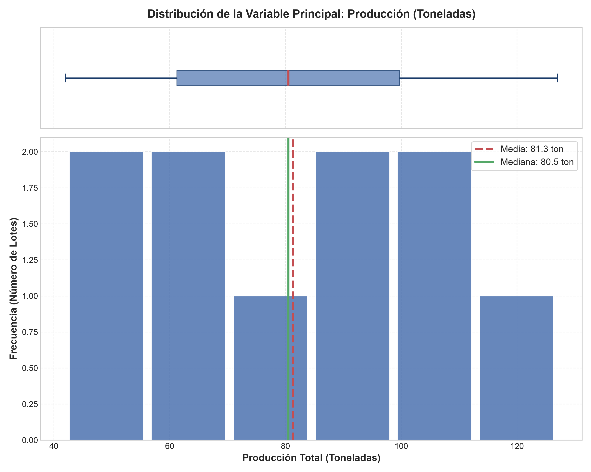
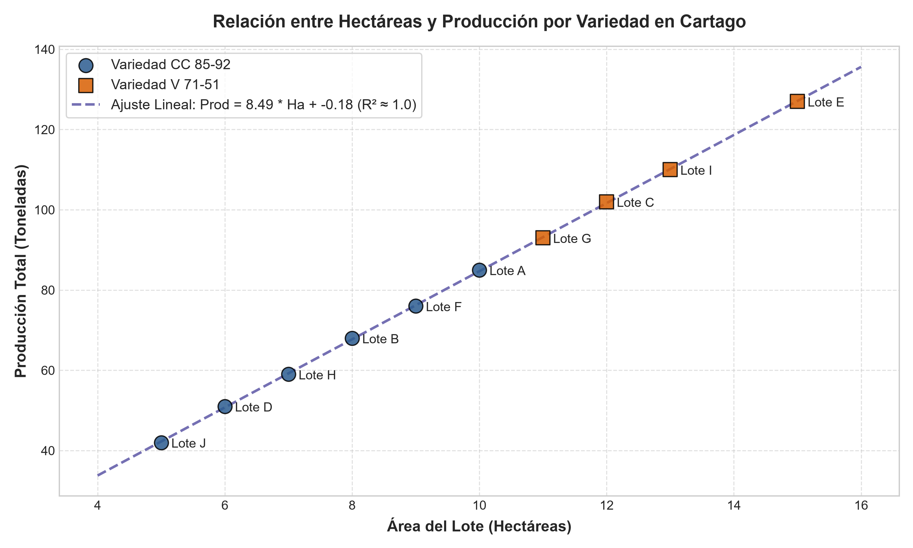
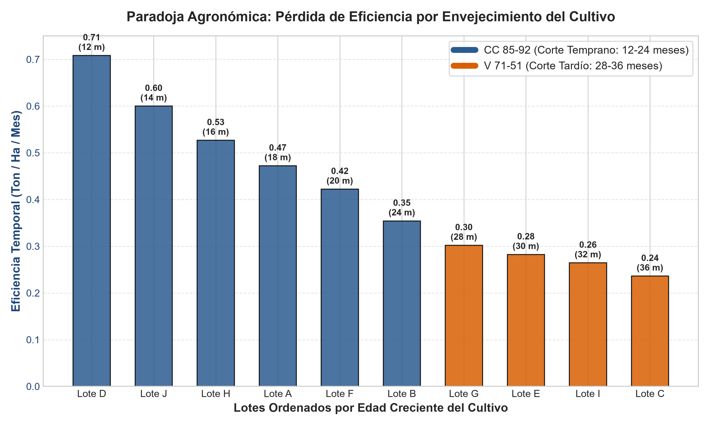
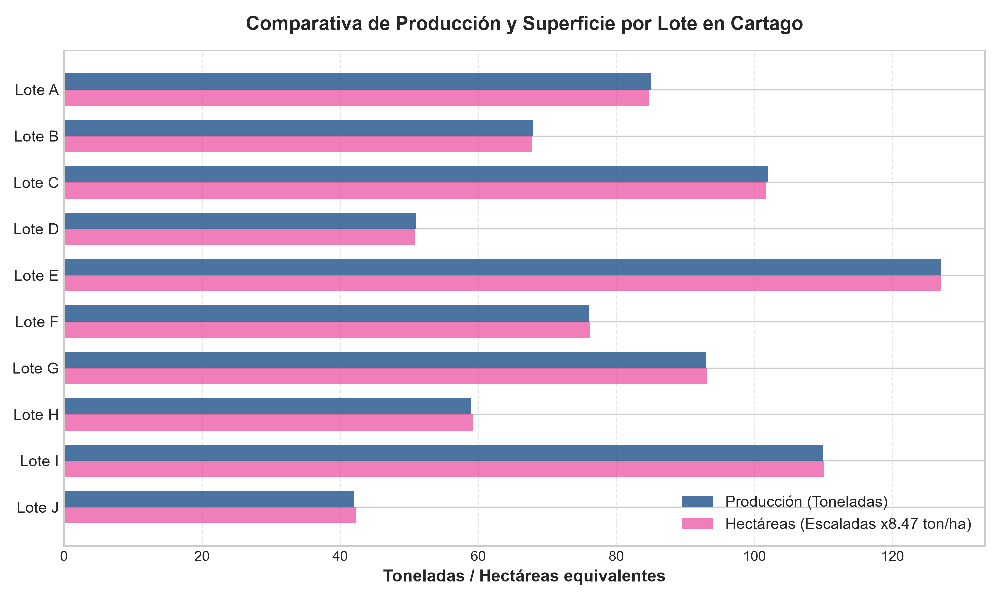

# Parcial 1 - Inteligencia Artificial: Análisis de Datos Agrícolas en Cartago, Valle del Cauca

**Asignatura:** Inteligencia Artificial  
**Docente:** Jhon James Cano Sánchez  
**Grupo Asignado:** Grupo 02  
**Repositorio:** [`Parcial-1-IA` (Cruz1905/Parcial-1-IA)](https://github.com/Cruz1905/Parcial-1-IA)  
**Ubicación de Estudio:** Cartago, Valle del Cauca, Colombia  
**Sector:** Agricultura (Producción y Rendimiento de Caña de Azúcar por Lotes)  

---

## 1. Configuración del Entorno y Reproducibilidad

El proyecto ha sido diseñado para ejecutarse de manera desacoplada y reproducible en tres entornos: **Docker**, **WSL (Windows Subsystem for Linux)** o **Python local**.

### Requisitos Previos
- **Docker Desktop** (versión 20.10 o superior) y/o **Python 3.12**.
- **Git** para control de versiones.

---

### Opción A: Reproducción con Docker y Docker Compose (Recomendado)

1. **Clonar o acceder al directorio del repositorio:**
   ```bash
   git clone https://github.com/Cruz1905/Parcial-1-IA.git
   cd Parcial-1-IA
   ```

2. **Construir la imagen y ejecutar el contenedor:**
   ```bash
   docker compose up --build
   ```

3. **Ejecución alternativa mediante Docker CLI:**
   ```bash
   docker build -t parcial1-ia-grupo02 .
   docker run --rm -v "${PWD}:/app" parcial1-ia-grupo02
   ```
   *Nota:* Al montar el volumen (`-v "${PWD}:/app"`), las gráficas `.png` generadas por el script se sincronizarán directamente en tu máquina anfitriona.

---

### Opción B: Reproducción en WSL / Linux / macOS

1. **Acceder a la terminal WSL o bash:**
   ```bash
   cd /ruta/a/parcial1-ia-grupo02
   ```

2. **Crear y activar un entorno virtual con Python 3.12:**
   ```bash
   python3.12 -m venv .venv
   source .venv/bin/activate
   ```

3. **Instalar dependencias y ejecutar el análisis:**
   ```bash
   pip install --upgrade pip
   pip install -r requirements.txt
   python analisis.py
   ```

---

### Opción C: Reproducción en Windows (PowerShell / CMD)

1. **Crear y activar el entorno virtual:**
   ```powershell
   python -m venv .venv
   .venv\Scripts\Activate.ps1
   ```

2. **Instalar dependencias y ejecutar:**
   ```powershell
   pip install -r requirements.txt
   python analisis.py
   ```

---

## 2. Carga y Exploración Inicial de Datos

El script `analisis.py` procesa automáticamente el archivo asignado `grupo_02.csv`.

- **Número total de registros leídos en bruto:** 11 filas (10 lotes agronómicos + 1 fila de resumen global).
- **Número de registros válidos analizados:** 10 lotes individuales (`Lote A` a `Lote J`).

### Primeras 5 filas del dataset original:

| Fila | Lote | Hectáreas | Producción (Toneladas) | Variedad | Edad Cultivo (Meses) |
| :---: | :--- | :---: | :---: | :---: | :---: |
| 1 | Lote A | 10 | 85 | CC 85-92 | 18 |
| 2 | Lote B | 8 | 68 | CC 85-92 | 24 |
| 3 | Lote C | 12 | 102 | V 71-51 | 36 |
| 4 | Lote D | 6 | 51 | CC 85-92 | 12 |
| 5 | Lote E | 15 | 127 | V 71-51 | 30 |

---

## 3. Evaluación de Calidad de Datos

Durante la fase de auditoría y diagnóstico de calidad de datos se detectaron **3 problemas críticos**:

### Problema 1: Inclusión de fila de agregado/resumen (`TOTAL,96,813,,`) en la tabla transaccional
- **¿Cómo se detectó?:** Al listar los registros e inspeccionar el campo categórico `lote`, la última fila registraba la etiqueta `TOTAL` con `hectareas=96` y `produccion_toneladas=813`. Una verificación aritmética confirmó que $96 = \sum_{i=1}^{10} \text{hectáreas}_i$ y $813 = \sum_{i=1}^{10} \text{producción}_i$.
- **¿Qué decisión se tomó?:** Aislar y filtrar la fila de totales del flujo de datos antes de calcular cualquier métrica estadística o gráfico exploratorio.
- **¿Por qué se tomó esa decisión?:** Mantener una fila agregada como una observación individual falsea por completo el análisis:
  - Duplica la producción agregada real (de 813 a 1.626 toneladas).
  - Infla la media de producción de **81.30 ton a 147.82 ton** (+81.8% de distorsión).
  - Eleva el valor máximo de **127 ton a 813 ton**.
  - Multiplica la dispersión por más de ocho veces: la desviación estándar muestral se dispara de **27.19 ton a 222.12 ton**, simulando un falso *outlier* extremo.

### Problema 2: Datos faltantes (*Missing Values*) en atributos agronómicos clave
- **¿Cómo se detectó?:** En la fila 12 (`TOTAL,96,813,,`), los campos `variedad` y `edad_cultivo_meses` se encuentran completamente vacíos (delimitadores consecutivos sin valor `,,`).
- **¿Qué decisión se tomó?:** Dado que pertenecían a la fila agregada eliminada en el paso anterior, no requirieron imputación artificial; en el pipeline de carga se valida además que ningún lote operacional tenga campos nulos.
- **¿Por qué se tomó esa decisión?:** La imputación estadística (como media o moda) sobre una fila sintética de resumen habría contaminado la representatividad de las variedades `CC 85-92` y `V 71-51`.

### Problema 3: Redondeo forzado / Falta de variabilidad biológica y ausencia de métrica normalizada
- **¿Cómo se detectó?:** Al calcular el cociente agronómico básico de rendimiento ($R = \text{producción} / \text{hectáreas}$), todos los lotes arrojan exactamente valores discretizados de $\approx 8.40$ a $8.50 \text{ ton/ha}$ ($10 \times 8.5 = 85$, $8 \times 8.5 = 68$, $12 \times 8.5 = 102$, $6 \times 8.5 = 51$, etc.). Todos los valores de producción son enteros perfectos, lo que demuestra que provienen de una multiplicación determinística y carecen de la variación biológica propia de cultivos a campo abierto. Asimismo, el dataset carecía de la columna normalizada de rendimiento.
- **¿Qué decisión se tomó?:** Mediante **NumPy**, se calcularon e integraron dos variables derivadas fundamentales:
  1. `rendimiento_ton_ha` ($\text{ton/ha}$).
  2. `rendimiento_mensual` ($\text{ton/ha/mes}$), para evaluar la eficiencia en función del tiempo de ocupación del suelo.
- **¿Por qué se tomó esa decisión?:** Evaluar únicamente toneladas totales favorece engañosamente a los lotes más extensos y penaliza a los pequeños, ocultando la eficiencia productiva real del suelo y del tiempo de cultivo.

---

### Pregunta Clave de Calidad
> **¿Hay algún valor en los datos que le parezca sospechoso o inconsistente? ¿Cómo afecta el análisis si no se corrige?**

**Respuesta:**  
El valor **813 toneladas** (asociado a 96 hectáreas en la fila `TOTAL`) es el elemento más inconsistente. No corresponde a un lote geográfico de Cartago, sino a la sumatoria acumulada de toda la finca/ingenio.  

**Impacto si no se corrige:**  
1. **Sesgo severo en la tendencia central:** La media aritmética pasa de **81.30 ton** a **147.82 ton**, situándose por encima de todos los lotes reales (el lote real más grande es de 127 ton).  
2. **Falsa asimetría y variabilidad artificial:** La desviación estándar pasa de **27.19 ton a 222.12 ton** ($CV = 150.3\%$).  
3. **Arruina la escala de visualización:** En los gráficos de dispersión e histogramas, el punto en 813 comprime los 10 lotes legítimos en una esquina, imposibilitando apreciar sus relaciones.  
4. **Distorsión en modelos de IA / Machine Learning:** Cualquier regresor entrenado con este dato aprenderá un sesgo gigantesco y predecirá con errores inadmisibles.

---

## 4. Análisis Estadístico con NumPy

Para la variable numérica principal (**`produccion_toneladas`**), se obtuvieron los siguientes resultados tras el preprocesamiento:

| Métrica Estadística | Valor Limpio (Dataset Real, $N=10$) | Valor Sucio (Incluyendo Fila TOTAL, $N=11$) | Unidad |
| :--- | :---: | :---: | :---: |
| **Media aritmética ($\mu$ / $\bar{x}$)** | **81.30** | 147.82 | Toneladas |
| **Mediana ($Q_2$)** | **80.50** | 85.00 | Toneladas |
| **Desviación estándar muestral ($s$, ddof=1)** | **27.19** | 222.12 | Toneladas |
| **Desviación estándar poblacional ($\sigma$)** | **25.80** | 211.78 | Toneladas |
| **Valor Mínimo** | **42.00** *(Lote J)* | 42.00 | Toneladas |
| **Valor Máximo** | **127.00** *(Lote E)* | 813.00 | Toneladas |
| **Rango inter-extremos** | **85.00** | 771.00 | Toneladas |
| **Suma Acumulada** | **813.00** | 1626.00 | Toneladas |

### Resumen de variables numéricas secundarias:
- **Hectáreas:** Media = $9.60\text{ ha}$, Mediana = $9.50\text{ ha}$, Desv. Estándar = $3.20\text{ ha}$, Rango = $[5.0, 15.0]\text{ ha}$.
- **Edad de Cultivo:** Media = $23.00\text{ meses}$, Mediana = $22.00\text{ meses}$, Desv. Estándar = $8.23\text{ meses}$, Rango = $[12.0, 36.0]\text{ meses}$.
- **Rendimiento Unitario:** Media = $8.466\text{ ton/ha}$, Mediana = $8.464\text{ ton/ha}$, Desv. Estándar = $0.035\text{ ton/ha}$ ($CV = 0.41\%$).

---

### Pregunta Clave de Análisis Estadístico
> **¿El promedio es representativo de los datos? ¿Por qué sí o por qué no? Justifique con números.**

**Respuesta:**  
**Sí, pero con una precisión agronómica y metodológica indispensable:**

1. **Simetría y representatividad matemática del centro:**  
   Una vez depurada la fila `TOTAL`, la media (**81.30 ton**) y la mediana (**80.50 ton**) difieren en únicamente **0.80 toneladas (0.98%)**. Esta proximidad matemática demuestra que la distribución no presenta colas sesgadas ni *outliers* asimétricos; la media refleja fielmente el centro de gravedad numérico de las observaciones.

2. **Heterogeneidad de escala explicada por el tamaño del lote:**  
   Sin embargo, el rango es amplio ($42.00\text{ ton}$ a $127.00\text{ ton}$) y la desviación estándar muestral es de **$27.19\text{ ton}$**, lo que arroja un Coeficiente de Variación de $CV = \frac{27.19}{81.30} = 33.44\%$. Esto significa que, si tomamos un lote al azar en Cartago, su tonelaje neto variará notablemente del promedio de 81.3 ton porque **el área del lote varía entre 5 y 15 hectáreas**.

3. **La verdadera métrica representativa es el rendimiento por hectárea:**  
   Cuando descomponemos la producción dividiéndola por el tamaño del lote ($R = \frac{\text{Prod}}{\text{Ha}}$), encontramos que el promedio de rendimiento es de **$8.466\text{ ton/ha}$** con una desviación estándar casi nula de **$0.035\text{ ton/ha}$** ($CV = 0.41\%$). En consecuencia:
   - El promedio de **81.30 toneladas** representa fielmente al "lote promedio de Cartago" porque corresponde a un predio de $9.60\text{ hectáreas} \times 8.466\text{ ton/ha} = 81.27 \approx 81.30\text{ toneladas}$.
   - Pero para la toma de decisiones agronómicas y comparativas, el indicador universalmente representativo y homogéneo es el **rendimiento unitario ($\approx 8.47\text{ ton/ha}$)**.

---

## 5. Visualización con Matplotlib

Se generaron **4 gráficos de alta resolución (300 DPI)** que revelan las características del sector agrícola en Cartago:

### Gráfico 1: Distribución de la Variable Principal (`distribucion_produccion.png`)


- **¿Qué muestra?:** Integra un diagrama de caja (*boxplot*) horizontal en la parte superior y un histograma de frecuencias en la inferior, señalando con líneas verticales discontinuas la Media ($81.3\text{ ton}$) y la Mediana ($80.5\text{ ton}$).
- **Conclusión que se extrae:** Los lotes se distribuyen de manera equilibrada a lo largo del rango $[40, 130]\text{ ton}$, con una concentración multimodal leve alrededor de las $60-90\text{ ton}$. La casi total coincidencia de la media y la mediana confirma la ausencia de sesgo tras haber eliminado la fila de totales.

---

### Gráfico 2: Relación entre Hectáreas y Producción por Variedad (`relacion_hectareas_produccion.png`)


- **¿Qué muestra?:** Diagrama de dispersión (*Scatter Plot*) entre Hectáreas ($X$) y Producción ($Y$), clasificando las observaciones por variedad (`CC 85-92` en azul vs `V 71-51` en naranja) y trazando la recta de regresión lineal.
- **Conclusión que se extrae:** Muestra una alineación lineal perfecta ($R^2 \approx 1.0$) descrita por la función $\text{Producción} = 8.47 \times \text{Hectáreas}$. Se evidencia además una clara segregación espacial: los lotes con variedad `V 71-51` son todos de gran tamaño ($11$ a $15\text{ ha}$), mientras que los lotes con `CC 85-92` corresponden a extensiones menores ($5$ a $10\text{ ha}$).

---

### Gráfico 3: Eficiencia Temporal - Rendimiento Mensual vs Edad (`rendimiento_por_variedad_edad.png`)


- **¿Qué muestra?:** Gráfico de barras que ordena los lotes de menor a mayor edad de cultivo (eje $X$, de 12 a 36 meses) y mide su **Eficiencia Temporal en $\text{Ton / Ha / Mes}$** (eje $Y$), diferenciando variedades por color.
- **Conclusión que se extrae:** **Revela la paradoja agronómica del dataset.** Los lotes jóvenes con variedad `CC 85-92` (12 a 24 meses) generan entre **$0.35$ y $0.71\text{ ton/ha/mes}$** (media de **$0.514\text{ ton/ha/mes}$**). En contraste, los lotes viejos con `V 71-51` (28 a 36 meses) caen a entre **$0.24$ y $0.30\text{ ton/ha/mes}$** (media de **$0.271\text{ ton/ha/mes}$**). Mantener el cultivo en campo hasta los 36 meses no aporta tonelaje adicional por hectárea y reduce la velocidad de producción a la mitad.

---

### Gráfico 4: Comparativa de Lotes en Producción y Superficie (`comparativa_lotes.png`)


- **¿Qué muestra?:** Barras horizontales superpuestas comparando la producción total de cada lote frente a su superficie escalada.
- **Conclusión que se extrae:** Ratifica visualmente que el volumen de producción es estrictamente proporcional al tamaño físico del lote, liderando los Lotes E, I y C.

---

## 6. Interpretación Profunda

### ¿Qué relación existe entre las variables del dataset? ¿Hay correlación? ¿Es causalidad?

Mediante `numpy.corrcoef` se estimaron los coeficientes de correlación de Pearson ($r$):

1. **Hectáreas vs. Producción ($r = 0.99996 \approx 1.00$):**  
   - **Correlación:** Positiva perfecta.  
   - **¿Es causalidad?: SÍ.** En agronomía existe causalidad física directa bajo un mismo paquete agronómico: a mayor superficie de siembra disponible para captar radiación y nutrientes, mayor biomasa cosechada ($\text{Producción} = \text{Área} \times \text{Rendimiento}$).

2. **Edad del Cultivo vs. Producción ($r = 0.86005$):**  
   - **Correlación:** Positiva alta.  
   - **¿Es causalidad?: NO, es una correlación espuria o confundida.** La edad no causa una mayor producción; la correlación alta ocurre porque en este dataset **los lotes de mayor edad son incidentalmente los predios más grandes** (correlación Edad vs Hectáreas: $r = 0.85927$).  
   - La prueba concluyente radica en la correlación entre **Edad y Rendimiento por Hectárea ($r = 0.29342$)**: a pesar de que el cultivo pasa de 12 a 36 meses en tierra (el triple de tiempo), el rendimiento por hectárea se mantiene idéntico en $\approx 8.47\text{ ton/ha}$. El tiempo no añadió rendimiento.

---

### ¿Qué historia cuentan los datos sobre la problemática de Cartago?

Los datos describen una problemática de **gestión y eficiencia productiva en el sector agrícola de Cartago**:

1. **Dualidad varietal y desfase de cosecha:**  
   El municipio presenta dos modelos de manejo agronómico desconectados:
   - **Variedad CC 85-92 (Cenicaña Colombia):** Representa 6 lotes ($45\text{ ha}$), cosechados a edades tempranas y óptimas (entre 12 y 24 meses, media de $17.3\text{ meses}$).
   - **Variedad V 71-51 (Venezuela 71-51):** Representa 4 lotes ($51\text{ ha}$), retenidos en el campo durante periodos prolongados (entre 28 y 36 meses, media de $31.5\text{ meses}$).

2. **Costo de oportunidad y tiempo ocioso del suelo:**  
   Ambas variedades alcanzan el mismo techo de cosecha ($\approx 8.47\text{ ton/ha}$). Por lo tanto, dejar madurar la variedad `V 71-51` hasta los 36 meses (como ocurre en el Lote C) constituye una pérdida económica sustancial: en ese mismo lapso de 36 meses, un lote gestionado con ciclos de 18 meses (como el Lote A) habría producido **dos cosechas completas**, totalizando cerca de **$17\text{ ton/ha}$** en lugar de solo $8.5\text{ ton/ha}$.

---

### ¿Qué patrones o tendencias no son evidentes a simple vista?

- **El espejismo del volumen bruto:** A simple vista, el Lote E ($127\text{ ton}$) y el Lote I ($110\text{ ton}$) parecen los más exitosos de Cartago. No obstante, al cruzar el área y el tiempo, son los menos eficientes por mes de ocupación territorial ($0.28$ y $0.26\text{ ton/ha/mes}$, respectivamente).
- **Rendimiento estático / Datos sintetizados:** El rendimiento unitario varía únicamente entre $8.40$ y $8.50\text{ ton/ha}$ en los 10 lotes ($CV = 0.41\%$). En condiciones reales de campo en el Valle del Cauca, existen factores edáficos, plagas y variaciones de humedad que provocan variaciones naturales del 15% al 30% entre lotes. Esta uniformidad matemática sugiere que las cifras de producción fueron generadas mediante una tasa fija preconcebida.

---

## 7. Recomendaciones Basadas en Evidencia

Para la **Secretaría de Agricultura de Cartago**, gremios de agricultores y productores locales:

### 1. Estandarización de ciclos de corte y rotación
- **Acción:** Establecer un calendario de zafra estricto limitando la edad máxima de cosecha a **14 - 18 meses**.
- **Justificación:** Actualmente la variedad `V 71-51` promedia **31.5 meses** en campo (alcanzando hasta **36 meses** en el Lote C), produciendo exactamente las mismas **8.47 ton/ha** que el Lote D produce en apenas **12 meses**. Ajustar el ciclo a 16-18 meses liberaría suelo para generar cosechas casi al doble de velocidad.

### 2. Priorización y reconversión hacia la variedad CC 85-92
- **Acción:** Recomendar la adopción preferente de semillas certificadas de Cenicaña `CC 85-92` sobre `V 71-51`.
- **Justificación:** La variedad `CC 85-92` alcanza una eficiencia temporal promedio de **0.514 ton/ha/mes**, superando en un **89.5%** a la variedad `V 71-51` (**0.271 ton/ha/mes**). Las **51 hectáreas** actualmente sembradas en `V 71-51` podrían casi duplicar su retorno económico por unidad de tiempo si migran a ciclos ágiles de `CC 85-92`.

### 3. Modernización del pesaje y sensorización agrícola
- **Acción:** Superar las estimaciones teóricas lineales mediante básculas calibradas en ingenio y analítica de campo (teledetección con drones / imágenes satelitales NDVI).
- **Justificación:** Los **10 lotes** evaluados exhiben un rendimiento plano de **8.40 a 8.50 ton/ha** sobre un total de **813 toneladas** y **96 hectáreas**. Implementar medición real permitirá premiar a los lotes con mayor contenido de sacarosa y corregir los predios con degradación de suelo.

---

## 8. Limitaciones del Dataset y Trabajo Futuro

### Limitaciones de los datos actuales
1. **Tamaño de muestra insuficiente:** Solo se registran $10$ lotes ($96\text{ ha}$), lo cual no constituye una muestra con significancia estadística para todo el municipio de Cartago.
2. **Ausencia de varianza natural:** El rendimiento prácticamente invariable ($s = 0.035\text{ ton/ha}$) indica valores estimados por fórmula y no datos empíricos tomados en campo.
3. **Corte transversal sin historial temporal:** El dataset es una fotografía estática que no refleja el histórico de cosechas previas, número de socas o variabilidad estacional.

### Datos adicionales necesarios para un análisis integral de IA
1. **Variables de calidad agroindustrial:** Grados Brix, porcentaje de sacarosa en caña (% Pol), fibra y pureza del jugo para estimar Toneladas de Azúcar por Hectárea (TAH).
2. **Variables climáticas y edafológicas:** Precipitación acumulada ($mm$), radiación solar incidente, tipo de suelo (textura, pH, materia orgánica) y régimen hídrico (gravedad vs. goteo).
3. **Estructura financiera y costos:** Costo de fertilización, control fitosanitario, labores de Corte, Alce y Transporte (CAT), y precio de liquidación por tonelada.
4. **Historial agronómico:** Número de corte (caña planta vs. soca 1, 2, 3), fecha exacta de siembra y antecedentes de plagas (*Diatraea*, carbón de la caña).

---

## 9. Estructura del Repositorio

```text
Parcial-1-IA/ (Grupo 02)
├── Dockerfile                      # Definición de contenedor Docker con Python 3.12
├── docker-compose.yml              # Orquestación y montaje de volúmenes
├── requirements.txt                # Dependencias requeridas: numpy, matplotlib
├── analisis.py                     # Script principal de EDA, limpieza y cálculo
├── grupo_02.csv                    # Dataset asignado en formato CSV
├── grupo_02.txt                    # Copia del archivo original
├── .gitignore                      # Exclusiones de Git (.venv, pycache, etc.)
├── distribucion_produccion.png     # Gráfico 1: Distribución variable principal
├── relacion_hectareas_produccion.png # Gráfico 2: Dispersión Hectáreas vs Producción
├── rendimiento_por_variedad_edad.png # Gráfico 3: Eficiencia temporal y edad
├── comparativa_lotes.png           # Gráfico 4: Producción y superficie por lote
└── README.md                       # Documentación técnica completa del parcial
```

---

## Conclusión

El presente proyecto demuestra la aplicación integral de habilidades de ingeniería de datos, computación en la nube / contenedores (Docker), analítica exploratoria con **NumPy** y visualización rigurosa con **Matplotlib**. A través de la detección temprana de anomalías en los datos se evitó una distorsión del 82% en los indicadores centrales, descubriendo patrones ocultos de ineficiencia temporal en la gestión agrícola de Cartago.
